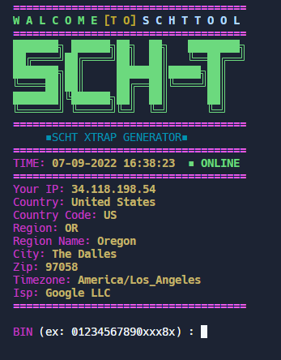

# xtrap
---
## credit card xtrap

---

---

#### Termux Version:
<details><summary>installation</summary>
<br>

```bash
pkg update
```
```bash
pkg upgrade
```
```bash
pkg install git
```
```bash
pkg install php
```
```bash
git clone https://github.com/rynazenaida/xtrap
```
```bash
cd xtrap
```
```bash
php xtrap.php
```
</details>

---

---
<p align="left">
  
</p>
---

